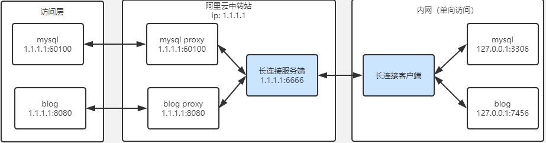

## go-huj-net-proxy 网络代理服务
### 背景
&nbsp;&nbsp;&nbsp;&nbsp; 家里路由器wan口不是外网ip，或者外网ip不固定，
一些做内网穿透的服务商价格昂贵并且端口数量受到限制, 比如某壳的内网穿透付费了也才两个端口映射，
增加一条端口需要198，我表示买不起，所以这个项目的目的是让家里的linux服务器的端口能让外网访问，
本人只用来搞搞学习，解决家里内网穿透问题    

### 实现方式
&nbsp;&nbsp;&nbsp;&nbsp; 1. 开发服务端，服务端部署在一个配置低的阿里云服务器        
&nbsp;&nbsp;&nbsp;&nbsp; 2. 开发客户端服务，部署在家里的linux服务器      
&nbsp;&nbsp;&nbsp;&nbsp; 3. 客户端跟服务端通讯，上传需要映射的端口，跟服务端建立长连接       
&nbsp;&nbsp;&nbsp;&nbsp; 4. 服务端接收客户端需要映射的端口开启不同的端口tpc监听     
&nbsp;&nbsp;&nbsp;&nbsp; 5. 在阿里云控制台 安全规则 那里开启对应客户端需要映射的端口   
&nbsp;&nbsp;&nbsp;&nbsp; 6. 每当一次远程请求过来，根据监听端口在map当中找到客户端服务服务长连接的哪个conn, 以此进行转发通讯

### 实现的功能    
&nbsp;&nbsp;&nbsp;&nbsp; 1. 内网路由随便穿透(需要一台公网代理服务器，配置及低都没问题)               

### 启动方式    
服务端配置   
[server]   
服务端启动端口          
port = 9200
    
客户端配置    
[client]    客户端配置       
配置代理客户端服务需要穿透的内网地址  这里配置内网地址和端口端口，以逗号隔开, 这里开启两个端口穿透      
proxyHosts=192.168.61.240:8090,192.168.61.240:8090:6379        
配置服务端地址, 比如服务端部署在阿里云中这里需要配置的地址是为了服务端跟客户端通讯                
serverUrl = 192.168.61.240:9200     
    
### ====================

